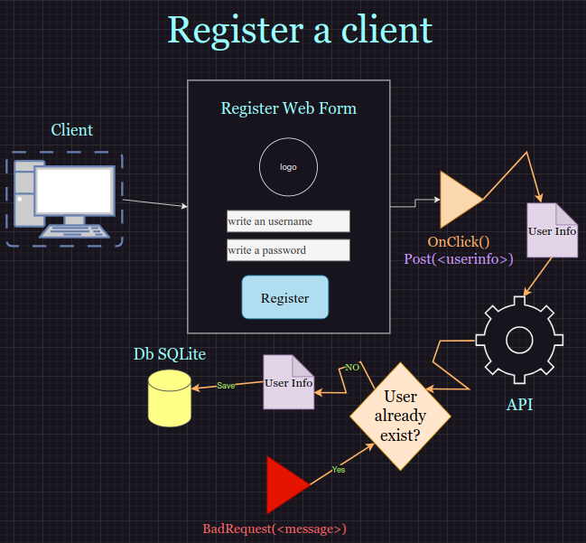

# Secure_API
This project encapsulates a user interface web page where users enter data to register in the system and obtain credentials to enter the submission request to the back-end system.

This is a test project to implement my knowledge of creating APIs in C# with the JWTBearer library and test the JWT (json web token) standard.

## What did I learn building this project?
1. User keys need to be encrypted and stored somewhere to record them for a long time in the system.

## Diagrams

 

 

 

